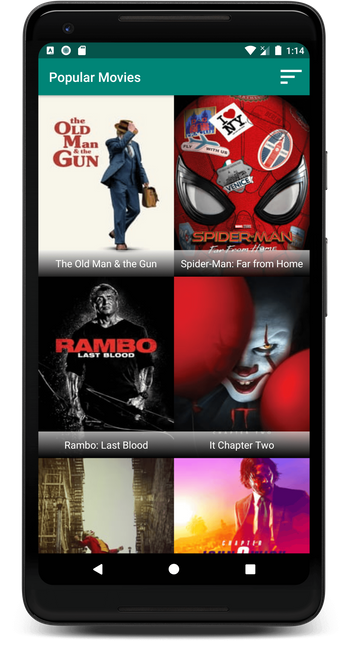
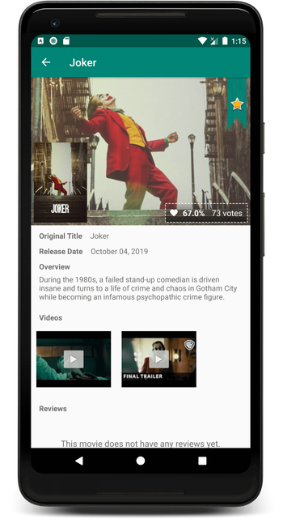
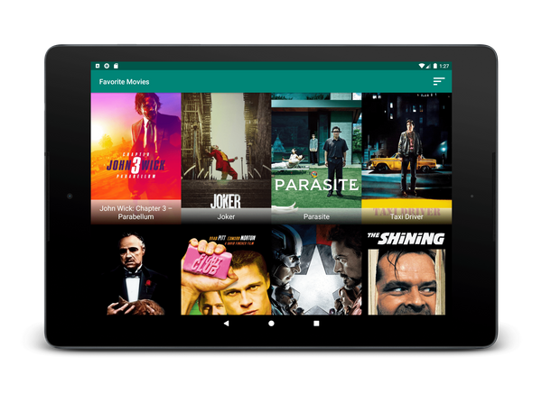
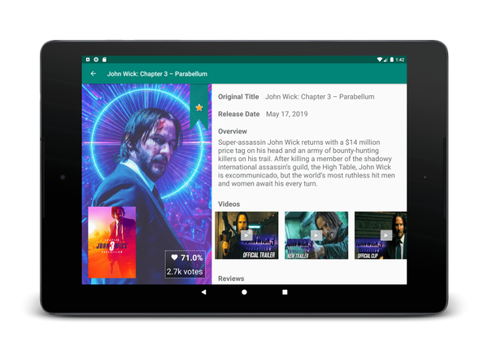

# Popular Movies Project

## Project Overview
In Project 2 + 3 of the Udacity Android Developer Nanodegree Program, **Popular Movies** app was developed in order to test:

1) TMDB API integration/interaction combined with JSON parsing
2) Layout design(UX/UI)
3) MVVM architecture implementation (Live Data + View Model)
4) Room DB implementation

## Features

1) Look up through menu items:
    - most popular movies
    - top rated movies
    - your favorite movies (stored in SQLite DB and available offline).
2) Tap on movie posters to look up:
    - detailed info like original name, release date, and average rating.
    - movie reviews and videos if available
    - mark movie as favorite

## ScreenShots

### Phone
 

### Tablet
 

## How to run the project?

You need to acquire an API Key from themoviedb.org by following the steps below:

1) [Create](https://www.google.com/url?q=https://www.themoviedb.org/account/signup&sa=D&ust=1565723396301000) an account on themoviedb.org
2) Navigate to Settings -> API -> "Create" tab -> "Developer" option. 
3) Fill in form to request an API Key. You can fill in dummy data in the form and edit later on.
4) After you acquire the key, set the API_KEY field in the AppConstants.java file.

## Libraries
* [Picasso](https://github.com/square/picasso)
* [ButterKnife](https://github.com/JakeWharton/butterknife)
* [Retrofit](https://square.github.io/retrofit/)
* [RxMarkdown](https://github.com/yydcdut/RxMarkdown)
