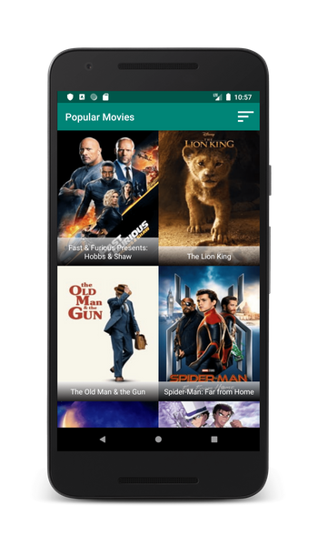
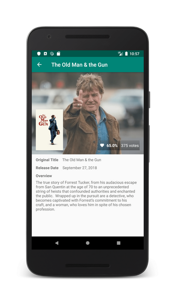
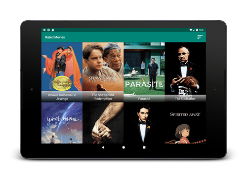
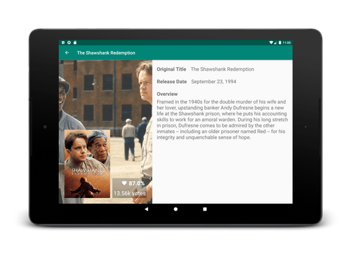

# Sandwich Club Project

## Project Overview
In Project 2 of the Udacity Android Developer Nanodegree Program, **Popular Movies** app was developed in order to
to allow users to discover the most popular movies playing by querying the [themoviedb.org](themoviedb.org) API.

The main focus of this project was to test API integration/interaction combined with JSON parsing and layout design(UX/UI).

## Features

1) Look up the most popular or the most rated movies.
2) Tap on movie posters to look up detailed info like original name, release date, overview etc...

## ScreenShots

### Phone
 

### Tablet
 

## How to run the project?

You need to acquire an API Key from themoviedb.org by following the steps below:

1) [Create](https://www.google.com/url?q=https://www.themoviedb.org/account/signup&sa=D&ust=1565723396301000) an account on themoviedb.org
2) Navigate to Settings -> API -> "Create" tab -> "Developer" option. 
3) Fill in form to request an API Key. You can fill in dummy data in the form and edit later on.
4) After you acquire the key, set the API_KEY field in the AppConstants.java file.

## Libraries
* [Picasso](https://github.com/square/picasso)
